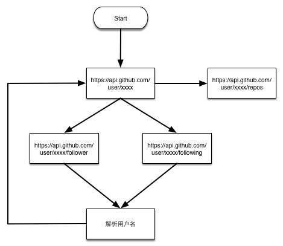
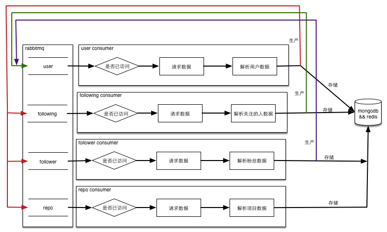
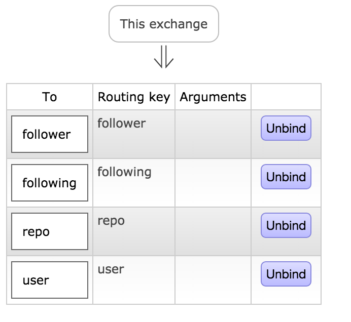

# 爬虫流程

在上周写完用scrapy爬去知乎用户信息的爬虫之后，github上star个数一下就在公司小组内部排的上名次了，我还信誓旦旦的跟上级吹牛皮说如果再写一个，都不好意思和你再提star了，怕你们伤心。上级不屑的说，那就写一个爬虫爬一爬github，找一找python大牛，公司也正好在找人。临危受命，格外激动，当天就去研究github网站，琢磨怎么解析页面以及爬虫的运行策略。意外的发现github提供了非常nice的API以及文档[文档](https://developer.github.com/guides/)，让我对github的爱已经深入骨髓。

说了这么多废话，讲讲真题吧。我需要下载github用户还有他们的reposities数据，展开方式也很简单，根据一个用户的following以及follower关系，遍历整个用户网就可以下载所有的数据了，听说github注册用户才几百万，一下就把所有的数据爬下来想想还有点小激动呢，下面是流程图：



这是我根据这个流程实现的代码，网址：[https://github.com/LiuRoy/github_spider](https://github.com/LiuRoy/github_spider)

# 递归实现

## 运行命令

看到这么简单的流程，内心的第一想法就是先简单的写一个递归实现呗，要是性能差再慢慢优化，所以第一版代码很快就完成了（在目录recursion下）。数据存储使用mongo，重复请求判断使用的redis，写mongo数据采用celery的异步调用，需要rabbitmq服务正常启动，在settings.py正确配置后，使用下面的步骤启动：

1. 进入github_spider目录
2. 执行命令```celery -A github_spider.worker worker loglevel=info```启动异步任务
3. 执行命令```python github_spider/recursion/main.py```启动爬虫

## 运行结果

因为每个请求延时很高，爬虫运行效率很慢，访问了几千个请求之后拿到了部分数据，这是按照查看数降序排列的python项目：


这是按粉丝数降序排列的用户列表


## 运行缺陷

作为一个有追求的程序员，当然不能因为一点小成就满足，总结一下递归实现的几个缺陷：

1. 因为是深度优先，当整个用户图很大的时候，单机递归可能造成内存溢出从而使程序崩溃，只能在单机短时间运行。
2. 单个请求延时过长，数据下载速度太慢。
3. 针对一段时间内访问失败的链接没有重试机制，存在数据丢失的可能。

## 异步优化

针对这种I/O耗时的问题，解决方法也就那几种，要么多并发，要么走异步访问，要么双管齐下。针对上面的问题2，我最开始的解决方式是异步请求API。因为最开始写代码的时候考虑到了这点，代码对调用方法已经做过优化，很快就改好了，实现方式使用了[grequests](https://github.com/kennethreitz/grequests)。这个库和requests是同一个作者，代码也非常的简单，就是讲request请求用gevent做了一个简单的封装，可以非阻塞的请求数据。

但是当我运行之后，发现程序很快运行结束，一查发现公网IP被github封掉了，当时心中千万只草泥马奔腾而过，没办法只能祭出爬虫的终极杀器--代理。又专门写了一个辅助脚本从网上爬取免费的HTTPS代理存放在redis中，路径proxy/extract.py，每次请求的时候都带上代理，运行错误重试自动更换代理并把错误代理清楚。本来网上免费的HTTPS代理就很少，而且很多还不能用，由于大量的报错重试，访问速度不仅没有原来快，而且比原来慢一大截，此路不通只能走多并发实现了。

# 队列实现

## 实现原理

采取广度优先的遍历的方式，可以把要访问的网址存放在队列中，再套用生产者消费者的模式就可以很容易的实现多并发，从而解决上面的问题2。如果某段时间内一直失败，只需要将数据再仍会队列就可以彻底解决问题3。不仅如此，这种方式还可以支持中断后继续运行，程序流程图如下：




## 运行程序

为了实现多级部署（虽然我就只有一台机器），消息队列使用了rabbitmq，需要创建名为github，类型是direct的exchange，然后创建四个名称分别为user, repo, follower, following的队列，详细的绑定关系见下图：



详细的启动步骤如下：

1. 进入github_spider目录
2. 执行命令```celery -A github_spider.worker worker loglevel=info```启动异步任务
3. 执行命令```python github_spider/proxy/extract.py```更新代理
4. 执行命令```python github_spider/queue/main.py```启动脚本

队列状态图：


